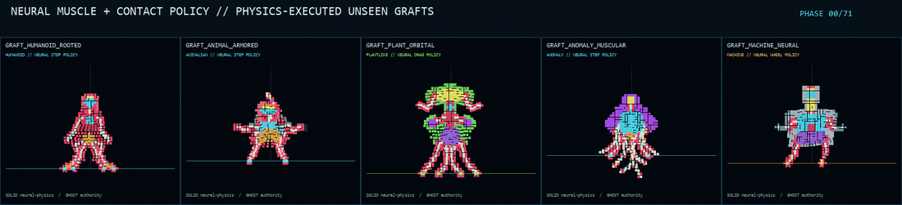
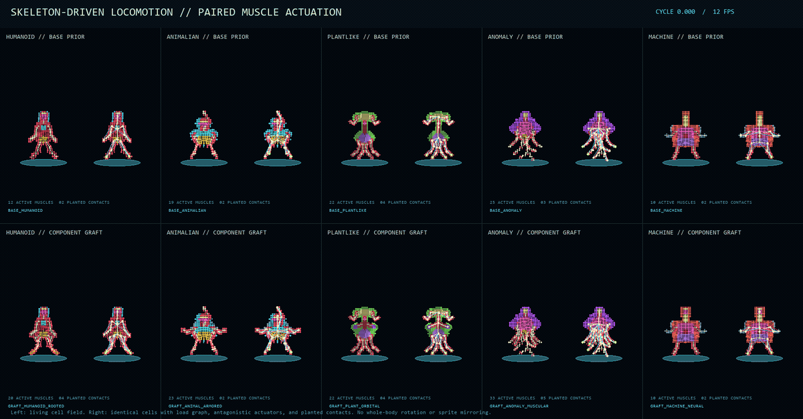
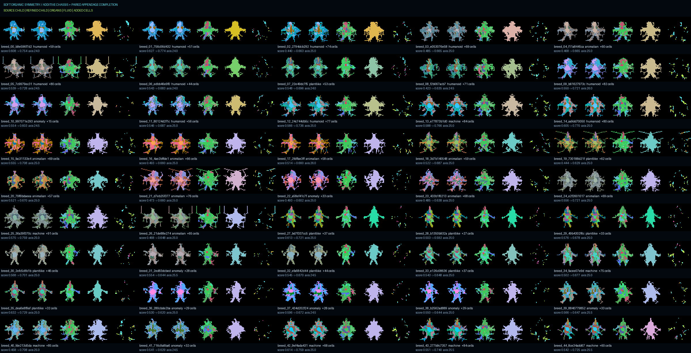
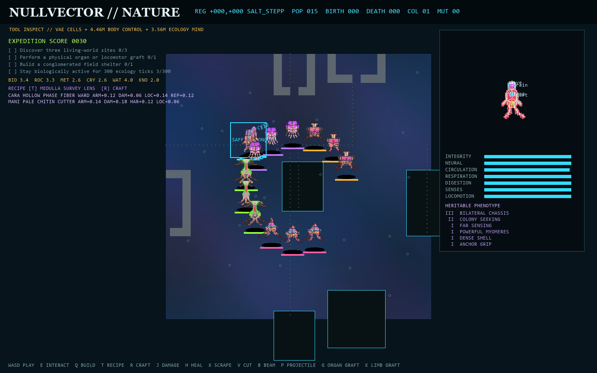
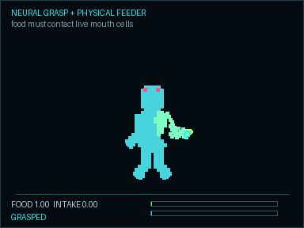
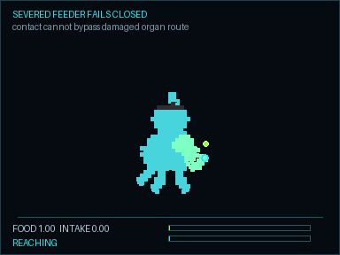

# NULLVECTOR

NULLVECTOR is a native Godot 4 top-down neon/pixel game and a reproducible
neural-content forge. Character identity is generated as aligned categorical
anatomy, material, and emission fields; animation is compiled from a logical
rig; maps are generated as validated semantic topology before pixel art is
baked. Python and neural checkpoints are build-time tools only. The shipped
Godot assets are PNG and JSON.

The early 32px vehicle experiment remains a replayable baseline. The active
pipeline is the 48px five-family forge described below.

## Visual outputs

The repository now includes a compact, directly browsable selection of real
generated artifacts. These are evidence from different stages of the current
pipeline—not concept art and not a claim that every subsystem is production
ready. The complete 59+ GiB output tree is mirrored separately because it is
too large for an ordinary GitHub repository.

| Neural cellular locomotion | Anatomical VAE motion | Grounded controller |
|---|---|---|
|  |  |  |

| Developmental scaffold | Cellular breeding | Living world scaffold |
|---|---|---|
|  |  |  |

| Articulated neural feeding | Articulated neural throw | Severed feeder gate |
|---|---|---|
|  |  |  |

The arm is a chassis-rooted cellular tube with fixed segment lengths, the same
physical class as the legs. No visible tether or telekinetic transfer is used.
The hand cells carry the clump to live feeder cells; the throw releases it into
free motion while the arm retracts.

See [examples/README.md](examples/README.md) for maps, trauma, NCA dynamics,
VAE reconstruction, Action-DiT evidence, source paths, and honest scope notes.

## Current playable reboot

The default Godot scene is now `CreatureStage.tscn`: a native 2.5D cellular
creature-stage prototype rather than the old wave arena. It is the first
causal scaffold for a longer research program whose target is one recurrent,
action-conditioned DiT world model with a continuous VAE viewport decoder.

The scaffold currently provides twenty named cellular chassis across five
genuinely different families,
internal organs and capacities, cell damage and healing, appendage motion,
ground-plane fluids, family-specific metabolism and actions, recurrent NPC
controllers, resources, reproduction, 49 streamed exact chunks, distant
ecology cohorts, seeded settlements/societies, a six-stage expedition arc,
resource delivery, live gene upgrades, and family-specific construction with
broad collision hulls. Bodies remain vertically aligned in 2.5D; appendages
and aim move, but the chassis never flips.

The native ecology can now replace abstract flora/biomass calories with
persistent material clumps and the accepted neural manipulation runtime.
Hungry organisms stop at appendage range, articulate a real cell-skinned limb
with fixed bone lengths, grasp the clump, curl it back to live feeder cells,
and metabolize the stored reserve over time. Plants retain light/water
physiology; anomalies and machines favor phase, charge, and mineral matter.
Predation and death produce tangible matter instead of transferring energy
instantly. This mode is save/resume and streamed-region persistent; legacy
teacher worlds remain available when the feeding bridge is omitted.

The development sequence is deliberately staged:

1. make the deterministic/procedural causal oracle fun and complete;
2. replace authorities with separately validated neural models;
3. reverse-distill the working ensemble into a monolithic recurrent
   action-DiT + VAE student while retaining auxiliary causal-state heads.

See `docs/creature_stage_reboot.md` for the product, simulation, scale, neural
authority, society/city, and acceptance contracts.

The same roadmap now extends to a persistent patched planet: a zoomable and
rotatable sphere whose stable surface patches can be focused into detailed
macro maps, while slower graph-diffusion updates advance weather, ecology,
migration, settlements, and history without losing patch identity.

The native scaffold also emits strict 240-transition causal teacher rollouts.
`python -m forge.creature_stage_trace TRACE.json` validates their producer
hash, state continuity, controls, organ conservation, physiology, and action
coverage before they are admitted to neural training data.

Playable morphology now includes four named chassis programs in each of the
five families (20 total). A 160-specimen native audit verifies connectivity,
vital organs, soft symmetry, 2.5D organ ordering, morphotype coverage, and
within-family signature diversity. The labeled native contact sheet is written
to `outputs/creature_stage_scaffold/morphology_contact2.png`.

Layered cellular motion now has thirteen states: breathe, wiggle, locomote,
joy, anger, fear, confused, sleep, taunt, attack, cast, hit, and death. Motion
acts on appendage chains, sensors, organs, weapons, phase tissue, and the
bounded corpse settle pose; it never rotates or flips the chassis. The native
motion gate covers all 20 x 13 combinations for 72 fixed-rate frames, runs two
identical bodies per clip, and rejects replay drift, non-finite motion, organ
changes, collapsed action, excessive displacement, or explosive death spread.

```powershell
C:\Users\forre\Desktop\Godot_v4.3-stable_win64.exe `
  --headless --path C:\Users\forre\Documents\neural-game\game -- `
  --creature-stage-motion-audit=C:\Users\forre\Documents\neural-game\outputs\creature_stage_scaffold\motion_audit.json

python -m forge.creature_stage_motion_audit `
  outputs/creature_stage_scaffold/motion_audit.json

C:\Users\forre\Desktop\Godot_v4.3-stable_win64.exe `
  --headless --path C:\Users\forre\Documents\neural-game\game -- `
  --creature-stage-motion-sheet=C:\Users\forre\Documents\neural-game\outputs\creature_stage_scaffold\motion_contact_sheet.png
```

The CPU-only sheet renderer avoids Windows viewport-capture instability and
renders the complete 260-pose matrix without requiring a graphics window.

The same authority can now be exported as a compact action-conditioned cell
trajectory corpus. It contains all 20 chassis x 13 motions x 72 frames, with
anatomy, genes, controls, events, and 4.2 million quantized per-cell position
samples. Two independent final exports are byte-identical and fail closed on
producer drift, malformed structure, tampering, collapsed motion, excessive
displacement, or a violation of the 100 GiB free-disk floor.

```powershell
C:\Users\forre\Desktop\Godot_v4.3-stable_win64.exe `
  --headless --path C:\Users\forre\Documents\neural-game\game -- `
  --creature-stage-motion-corpus=C:\Users\forre\Documents\neural-game\outputs\creature_stage_motion_corpus_v1_final_a

python -m forge.creature_stage_motion_corpus `
  outputs/creature_stage_motion_corpus_v1_final_a
```

See `docs/creature_stage_motion_corpus.md` for the binary layout, replay
contract, hashes, and current training scope.

An aligned intervention corpus adds wounds, healing, cuts, neural loss, and
circulatory, respiratory, digestive, and sensory ablations. It stores 32,400
causal frames over the same 20 chassis: per-cell health/alive state and local
position, organ capacities, death state, energy/hydration, and up to 160 exact
ground-plane fluid particles. The validator derives each reported capacity
from the underlying living organ cells and rejects a merely self-consistent
manifest.

```powershell
C:\Users\forre\Desktop\Godot_v4.3-stable_win64.exe `
  --headless --path C:\Users\forre\Documents\neural-game\game -- `
  --creature-stage-intervention-corpus=C:\Users\forre\Documents\neural-game\outputs\creature_stage_intervention_corpus_v1_final_a

python -m forge.creature_stage_intervention_corpus `
  outputs/creature_stage_intervention_corpus_v1_final_a
```

See `docs/creature_stage_intervention_corpus.md` for the causal field layout
and evidence.

The first Stage 2 replacement bound directly to these native cells is now a
27.4M-parameter recurrent cellular motion transformer. Each anatomical cell is
a token; global attention coordinates the whole organism while an explicit
grid-neighbor path preserves local chassis and appendage connections. It
conditions on family, structural morphotype, motion, phase, move/aim vectors,
action channels, and external events. One chassis per family is validation and
another is sealed test.

```powershell
python -m forge.creature_stage_neural_motion model-info
python -m forge.creature_stage_neural_motion validate-smoke `
  --output outputs/creature_stage_neural_motion/smoke_cpu_v1_final
python -m forge.creature_stage_neural_motion prepare-production
python -m forge.creature_stage_neural_motion evaluate --help
python -m forge.creature_stage_neural_motion export-onnx --help
```

It is not runtime authority yet. Its evaluator rolls EMA predictions forward
on their own state across unseen chassis and refuses promotion on
family/action collapse, weak motion energy, bond incoherence, or provenance
drift. Production training, portable export, and native parity remain
promotion requirements. A strict ONNX path is already proven on the smoke
checkpoint with dynamic batches and held-out numerical parity. See
`docs/creature_stage_neural_motion.md`.

Damage, organ function, viability, and ground-plane fluid dynamics now have a
separate 16.7M-parameter native-cell physiology transformer candidate. It
shares the 384-cell anatomical token contract, adds a ten-capacity organism
head and 160-token puddle branch, and learns from all nine strict intervention
trajectories without changing chassis support.

```powershell
python -m forge.creature_stage_neural_physiology model-info
python -m forge.creature_stage_neural_physiology validate-smoke `
  --output outputs/creature_stage_neural_physiology/smoke_cpu_v1
python -m forge.creature_stage_neural_physiology prepare-production
python -m forge.creature_stage_neural_physiology evaluate --help
```

Its prediction-fed evaluator explicitly rejects healthy-control collapse,
incorrect organ ablation, missing leaks, and fluid-count drift rather than
letting a low average loss authorize gameplay. See
`docs/creature_stage_neural_physiology.md`.

## Current production sprite path

The rest-identity model is a 23.8M-parameter absorbing-state categorical
diffusion network. It predicts three aligned native 48x48 fields:

| field | vocabulary |
| --- | ---: |
| part owner | transparent plus 16 semantic ownership slots |
| material | transparent plus nine material roles |
| emission | off, reactive, emissive, radiant |

It is conditioned independently on morphology family, family-local subtype,
combat role, a 24-value genome, and an anti-leak graph scaffold. Exact target
silhouette/body/core channels are removed during production training so the
model cannot copy the procedural training renderer.

The five morphology families are:

- humanoid;
- animalian;
- plantlike;
- anomaly;
- machine.

Every family is crossed with striker, defender, scout, controller, support,
artillery, harvester, and disruptor roles. The deterministic training corpus
contains 32,768 specimens balanced across all family, subtype, and role
strata. The final 72-epoch production checkpoint generated an immutable
80-sample balanced audit bank covering all 5 x 8 family/role cells twice. All
80 pass the strict categorical, topology, margin, scaffold, tuple, condition,
and provenance gates and replay exactly.

Neural output is never converted to a procedural silhouette. Raw categorical
fields remain the authority and are stored before any presentation step.

## Pixel presentation

`forge.multifield_style` compiles each immutable identity into seven native,
nearest-filtered RGBA layers:

1. material-shaded base;
2. one-pixel chromatic outline;
3. emission core;
4. partial-alpha aura;
5. bloom radius 1;
6. bloom radius 2;
7. exact composite.

The presentation compiler uses deterministic perceptual palette ramps and
semantic family/role shading. It cannot change categorical anatomy. The full
80-identity static bank is in `outputs/multifield_style/final_best_stratified80_v3`.

## Neural identity motion

Animation is hybrid by design: diffusion constructs the identity once, then a
graph rig transforms those exact neural pixels with nearest-neighbor affine
drivers. This avoids the temporal identity drift and softened one-pixel detail
of independent per-frame RGB diffusion.

The motion vocabulary is:

- `idle_breathe`, `idle_wiggle`, and `locomote`;
- `joy`, `anger`, `fear`, `confused`, `sleep`, and `taunt`;
- `attack`, `cast`, `hit`, and `death`.

All motions support eight facings and carry transformed joints, sockets,
events, loop metadata, aligned categorical fields, and seven presentation
layers. The first production neural-motion bank animates one exact neural
representative per family: 5 identities, 520 clips, and 4,720 frames. Exact
replay recompiles 63 artifacts and 23,698,097 bytes, including deterministic
ffmpeg showcase encoding.

The complete 80-sample binding census is explicit: 70 bind under the frozen v1
contract and 10 are rejected for background anchors, one plant topology case,
missing required owners, or safety-margin violations. The bank does not claim
that all 70 bindable identities were animated. A separate logical repair-v2
experiment is expanding coverage without changing any rest pixel.

The production bank lives at:

```text
outputs/multifield_style_neural_motion/
  motion_style_neural_manifest.json
  verification_report.json
  neural_motion_contact_sheet.png
  neural_motion_showcase_poster.png
  neural_motion_showcase.mp4
  identities/
```

## Semantic maps and pixel art

Six deterministic generators cover arena, rooms, caves, archipelago, garden,
and anomaly themes. A topology-v2 map stores terrain, walkability, hazard,
elevation, zones, navigation cost, mission points, and three generation-time
authority masks:

- `protected_backbone`: cells written by exact mission-route carves;
- `required_clearance`: safe disks written around mission points and spawns;
- `decoration_forbidden`: backbone, clearance, and final hazards.

The protected route is five cells wide and must survive square one-cell agent
erosion. Start, exit, and objectives must remain connected both geometrically
and without hazards. Masks are captured at mutation sites and never inferred
afterward.

`forge.map_art` turns semantic truth into 8px neon autotiles, elevation/drop
edges, base and emission layers, theme-specific objects and decals, collision
and occlusion metadata, and eight-frame laser/lava/spore/arc animation sheets.
Art cannot change topology.

`forge.map_quality` independently audits geometric, safe, and radius-one-safe
routes; intrinsic shortest-path hazard and clearance metrics; agent-scale
mission articulation; spawn dispersion; elevation/zone diversity; and exact
pack provenance. Fully rehashed report tampering is caught by pack-backed
replay.

The neural map decorator consumes a frozen 3,096-map topology-v2 corpus and
predicts only safe variant, decal, prop, and emission fields. It never predicts
terrain, collision, mission routes, or topology masks. Training is segmented
into fresh two-epoch CUDA processes with immutable checkpoints and exact resume
because this host has demonstrated intermittent native process corruption.
The current v4 hybrid exposes the renderer's public SplitMix64 proposal substrate
and applies a frozen-core neural residual only to decal/prop conflict suppression.
Its bounded 64-step calibration exact-replays the complete validation and sentinel
splits, improves both object heads, preserves variant/emission exactly, and is not
yet a production or Godot integration claim.

A learned structural map prior is being developed separately as a discrete VQ
codec plus masked latent diffusion. The codec now has an accepted, exactly
replayed 500-step representation milestone over the frozen 3,096-map corpus:
held-out EMA walkability IoU is 0.830/0.852 on validation/sentinels, with every
frozen reconstruction gate passing. It is still not a generator. Its future raw
latent proposals must pass through the deterministic topology compiler and an
explicit edit ledger before they can become runtime map packs.

The next masked-latent stage now has an exact-replayed CPU foundation. It freezes
the accepted codec, supports structured inpainting masks and parallel token
reveal, and publishes six theme-balanced raw latent proposals under an explicit
non-map claim boundary. Its two training steps are a pipeline proof only; no
generative-quality or runtime claim is made.

Its production input is now frozen as a 216-shard latent corpus covering all
3,096 maps. Every shard was re-encoded from source in a separate CPU process;
the complete 2,496/576/24 train/validation/test census passed with zero retry,
access violation, or timeout. The corpus is only a training substrate and does
not weaken the compiler/runtime authority boundary.

## Native Godot Workshop

`game/ForgeHub.tscn` is the additive native front door to the forge. Its neon,
filterable catalog launches fourteen current game and research scenes, hashes
thirteen runtime catalogs, and locks any card whose scene, format, status,
census, or Python-free runtime contract has drifted. `OPEN` changes the current
scene; `DETACH` preserves the hub while opening a lab in a second native
instance. See `docs/native_forge_hub.md`.

`game/NeuralWorkshop.tscn` is an additive native inspection scene. It currently
loads a ready runtime bundle with:

- 80 real neural static identities and 560 static layer regions;
- 35 neural motion atlases, 520 clips, and 4,720 checked atlas regions;
- six topology-v2 maps, 96 map layers, and 138 map frames;
- 69 exact runtime file hashes;
- nearest filtering and no Python runtime requirement.

The sync validates canonical schemas, the full 80 -> 70/10 binding census, the
five exact motion representatives, all presentation atlases, the motion replay
proof, topology-v2 sources, and the 100 GiB disk floor. Godot smoke constructs
every AtlasTexture region rather than trusting the index.

The Workshop is deliberately not the main scene. `game/project.godot` still
starts `res://Arena.tscn`, whose baseline hash is preserved by every asset
sync.

## Reproducibility and safety

The forge treats every stage as a versioned artifact contract:

- canonical source, corpus, split, checkpoint, EMA, and artifact hashes;
- raw-before-compiled storage;
- exact dtype, shape, vocabulary, and bounded container checks;
- atomic publication with no destructive checkpoint rotation;
- deterministic RNG state and exact replay;
- a 100 GiB minimum free-disk guard;
- fail-closed validators and process-isolated retries.

Long Windows fuzz runs exposed intermittent native access violations at moving
Python locations. The root hardware/firmware issue is not claimed solved.
Production corpus builds, validation, training, and long fuzzing therefore use
fresh bounded worker processes and retain exact crash/retry telemetry.

## Key commands

Run from this directory with the CUDA-enabled Python 3.12 environment.

Focused tests:

```powershell
python -m pytest
```

Production neural sprite evaluation and exact replay:

```powershell
python -m forge.multifield_eval snapshot `
  checkpoints/multifield_production_v2/best.pt `
  checkpoints/evaluation_snapshots/unique.pt

python -m forge.multifield_style_neural_motion replay `
  outputs/multifield_style_neural_motion/motion_style_neural_manifest.json `
  --report outputs/multifield_style_neural_motion/verification_report.json
```

Map generation, rendering, and audit:

```powershell
python -m forge.maps generate --output outputs/maps_v2
python -m forge.map_art showcase `
  --map-sources outputs/maps_v2_forge_lab `
  --output outputs/map_art

$packs = Get-ChildItem outputs/maps_v2_forge_lab -Directory
python -m forge.map_quality $packs.FullName `
  --report outputs/map_quality/forge_lab_v1.json `
  --showcase outputs/map_quality/showcase
```

Strict ready-only Native Workshop sync:

```powershell
python -m forge.neural_workshop_sync `
  --require-neural-motion-ready `
  --repeat-check `
  --report outputs/neural_workshop_sync_ready_report.json
```

Godot 4.3 import and exhaustive headless smoke:

```powershell
C:\Users\forre\Desktop\Godot_v4.3-stable_win64.exe `
  --headless --editor `
  --path C:\Users\forre\Documents\neural-game\game --quit

C:\Users\forre\Desktop\Godot_v4.3-stable_win64.exe `
  --headless `
  --path C:\Users\forre\Documents\neural-game\game `
  res://NeuralWorkshop.tscn -- `
  --neural-workshop-smoke `
  --neural-workshop-report=C:/Users/forre/Documents/neural-game/outputs/neural_workshop_godot_ready_report.json
```

Launch and audit the complete native lab index:

```powershell
C:\Users\forre\Desktop\Godot_v4.3-stable_win64.exe `
  --path C:\Users\forre\Documents\neural-game\game `
  res://ForgeHub.tscn

C:\Users\forre\Desktop\Godot_v4.3-stable_win64.exe `
  --headless `
  --path C:\Users\forre\Documents\neural-game\game `
  res://ForgeHub.tscn -- `
  --forge-hub-smoke `
  --forge-hub-report=C:/Users/forre/Documents/neural-game/outputs/forge_hub_smoke_report.json
```

Launch the native game with:

```powershell
C:\Users\forre\Desktop\Godot_v4.3-stable_win64.exe `
  --path C:\Users\forre\Documents\neural-game\game
```

Creature-stage controls: WASD moves, the mouse aims, left click attacks, E
assimilates/interacts, Q uses the family utility, F builds, R mutates, Space
sprints, and Z/X/C/V/B trigger emotes. Workshop controls are documented in
`docs/native_neural_workshop.md`.

## Where to read next

- `docs/multifield_training.md`
- `docs/multifield_evaluation.md`
- `docs/multifield_style_compiler.md`
- `docs/neural_rig_bridge.md`
- `docs/multifield_style_neural_motion.md`
- `docs/neural_map_decoration.md`
- `docs/neural_map_topology_model.md`
- `docs/native_neural_workshop.md`
- `docs/native_forge_hub.md`
