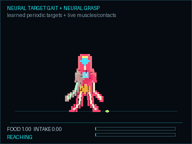
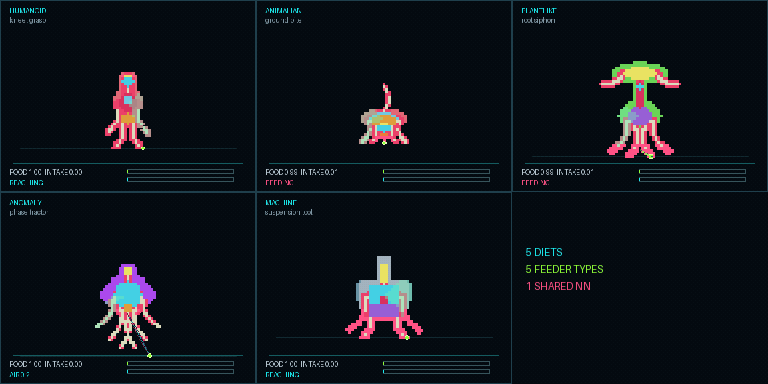
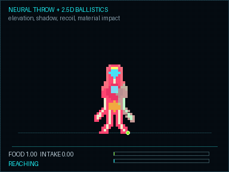
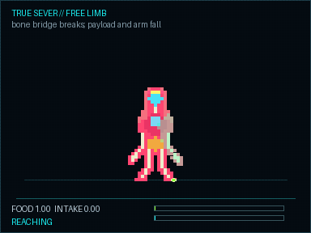
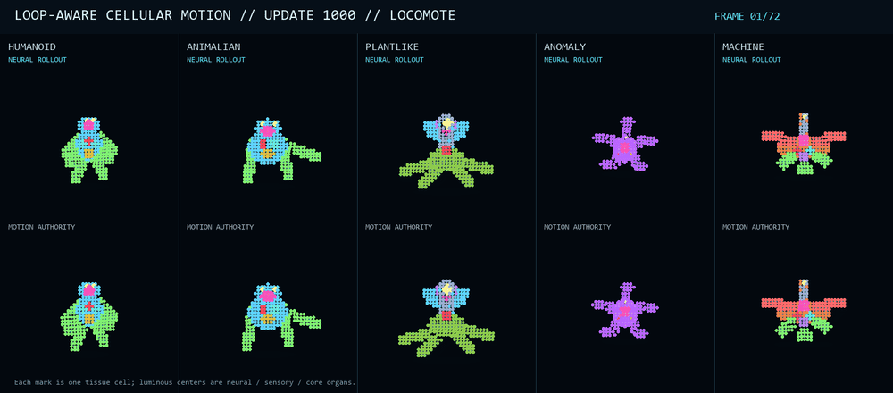
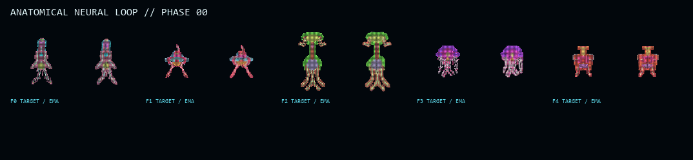
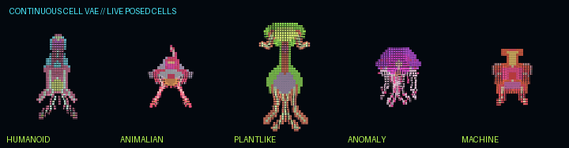

# NULLVECTOR

NULLVECTOR is a 2.5D cellular world simulation built around physical creatures,
ecology, evolution, and neural rendering. The short version is:

**Powder Game + Spore + Rain World + Caves of Qud.**

The current build is a playable research prototype. Creatures are assembled
from cells, organs, skeletons, muscles, fluids, and articulated appendages.
They move through a top-down world while remaining vertically oriented. They
can feed, fight, heal, reproduce, mutate, grasp materials, lose limbs, and die.

The long-term target is one recurrent action-conditioned DiT with a continuous
VAE decoder: controls and world state in, playable frames and causal state out.
We are getting there in stages instead of pretending one model already does
everything.

## Current build

- Five organism families: humanoid, animalian, plantlike, anomaly, and machine.
- Cellular bodies with organs, circulation, fluids, damage, healing, scarring,
  severing, and death.
- Grounded musculoskeletal locomotion with planted feet, limb constraints, and
  family-specific movement.
- Articulated grasping, feeder contact, throwing, recoil, elevation, shadows,
  bounce, roll, and thud material responses.
- Family-specific acquisition: hands, mouths, roots, phase fields, and machine
  tools.
- Metabolism, predation, reproduction, mutation, resources, construction,
  settlements, and persistent streamed regions.
- Validated semantic maps across six visual themes.
- Native Godot 4 runtime with Python used for training, evaluation, and asset
  generation.

The simulation is broad but still early. Creature construction and physical
interaction are the strongest parts. Ecology, societies, cities, and planetary
scale exist as scaffolds and research systems rather than a finished game.

## Selected results

| Playable neural foundation |
|---|
|  |

The live nature simulation now batches current posed and damaged cells through
the continuous organism VAE while neural controllers drive locomotion,
physiology, feeding, behavior, colonies, societies, and forecasts.

| Grounded motion and feeding | Five feeding strategies |
|---|---|
|  |  |

| Ballistic throwing | True limb severing |
|---|---|
|  |  |

| Neural cellular locomotion | Anatomical VAE motion |
|---|---|
|  |  |

| Continuous neural cell raster |
|---|
|  |

More results are in the [output gallery](examples/README.md).

## What is neural

NULLVECTOR currently uses an ensemble. Deterministic systems remain wherever
they are still the safer or better authority.

| System | Current authority |
|---|---|
| Creature fields and identity | Neural categorical generation with validated anatomy fields |
| Sprite rasterization | Promoted continuous cell VAE; current posed cells in, 96x96 RGBA out |
| Grounded motion | Neural muscle/contact feedback inside physical constraints |
| Limb pose and grasping | Neural inverse-muscle and grasp controllers inside an articulated solver |
| Local cell dynamics | Promoted causal cellular NCA with organ-ablation and rollout gates |
| Maps | Procedural topology authority with neural topology and decoration models under evaluation |
| Ecology and societies | Neural behavior, colony, society, timeline, and counterfactual specialists inside the causal scaffold |
| World frames | Recurrent Action-DiT + adapted continuous VAE change compositor; live in the Python nature stage, not yet the native Godot authority |

Composite Build 2 loads 67.7M parameters across the
Action-DiT, world VAE, exact-parent pixel refiner, actor-state student, organism
cell VAE, and causal physiology model. The larger 13-specialist teacher
ensemble is hash-closed for reverse distillation.

The first recurrent action-frame student now beats exact frame persistence by
10.43% on its untouched cellular world. Its decoder adaptation cuts cellular
reconstruction MAE by 91.0% while keeping the original encoder and latent
contract frozen. This result is promoted as a tested component, not yet as the
authoritative world simulation. It is callable in the nature stage as the live
action-conditioned future view.

The next recurrent student carries both visual and 128-feature organism state
through contiguous rollouts. On the untouched world it beats its unchanged
parents by 2.36–2.79% at every 4–32 step horizon, while beating initial-frame
persistence by 9.10–12.33%. Its validated stream runtime is now the live F6
diagnostic path at 9.4–10.6 recurrent steps/s and 490 MiB peak reserved VRAM. The
historical training set included diagnostic overlays, so this model is kept out
of clean student view until it is retrained on the new overlay-free targets.

The overlay-free successor corpus now contains 2,376 contiguous frames across
six worlds and all 22 action classes. Its first clean recurrent student beats
the historical model at every 1–32 step horizon and beats frame persistence at
8, 16, and 32 steps. It still misses the four-step persistence gate, so it
remains an experimental checkpoint rather than runtime authority.

The physical projector still enforces bone lengths, attached roots, planted
contacts, collision safety, and feeder contact. That is intentional. The
callable ensemble is now integrated into the nature stage; the next phase is
broader rollout evaluation and reverse distillation into a recurrent student.

## Run the game

Requirements:

- Godot 4.3
- Python 3.12 for forge and training tools
- A CUDA-capable GPU for production training; the native game does not require
  Python or CUDA

Open `game/project.godot` in Godot, or launch it directly:

```powershell
C:\path\to\Godot_v4.3-stable_win64.exe --path C:\path\to\nullvector\game
```

The main scene is `CreatureStage.tscn`.

Controls:

- `WASD` — move
- Mouse — aim
- Left click — attack
- `E` — interact or assimilate
- `Q` — family utility
- `F` — build
- `R` — mutate
- `Space` — sprint
- `Z/X/C/V/B` — expressions and actions

The Python nature-stage demo uses `F1` for a click-driven overlay panel. It
only controls presentation and information: vision and sensed-target markers,
anatomy and organs, integrity bars, labels, ecology links, settlements, sites,
atlas, shadows, selection, evolution offers, mechanism telemetry, and the
status HUD. `F2` switches to a clean student view containing only the world,
entities, structures, materials, shadows, and physical effects, then restores
the previous overlay configuration when pressed again. `L` toggles the vision
field directly; `Shift+L` toggles sensed-target markers. Teacher trajectories
are captured before any diagnostic overlay is composited. These controls never
pause or disable simulation, physics, AI, metabolism, damage, or ecology.

## Forge and tests

Install the Python package dependencies, then run:

```powershell
python -m pytest
```

Useful entry points:

```powershell
# Generate semantic maps
python -m forge.maps generate --output outputs/maps_v2

# Render map art
python -m forge.map_art showcase `
  --map-sources outputs/maps_v2_forge_lab `
  --output outputs/map_art

# Replay the neural motion bank
python -m forge.multifield_style_neural_motion replay `
  outputs/multifield_style_neural_motion/motion_style_neural_manifest.json `
  --report outputs/multifield_style_neural_motion/verification_report.json
```

Most generated corpora, checkpoints, and evaluation banks are intentionally
excluded from Git. Curated visual results live under `examples/showcase/`.

## Architecture

```text
game/                 Godot runtime and playable scenes
forge/                generators, models, trainers, evaluators, and compilers
shared/schema/        artifact and replay contracts
docs/                 subsystem design and validation notes
examples/showcase/    compact visual results for GitHub
outputs/              local generated artifacts and checkpoints
```

Every promoted neural component is evaluated against the causal scaffold. A
model does not become runtime authority because its loss decreased; it must
preserve anatomy, contacts, motion, damage semantics, and replay integrity.

## Roadmap

1. Finish the neural creature foundation: morphology, rasterization, grounded
   locomotion, grasping, feeding, damage, and physiology.
2. Build a sustainable nature simulation with stable ecosystems, breeding,
   colonies, and mutation.
3. Expand into traits, equipment, construction, cities, societies, history,
   quests, and Caves of Qud-scale systemic variety.
4. Run the world as persistent patches on a zoomable planet with slower neural
   weather, migration, biome, and settlement updates.
5. Reverse-distill the proven ensemble into a recurrent action-DiT + VAE world
   model.
6. Optimize the finished desktop system for high-end mobile hardware.

The goal is not an AI-generated content demo. It is a real game and a proof
that neural game systems can be deep, coherent, inspectable, and worth playing.

## Documentation

- [Creature-stage design](docs/creature_stage_reboot.md)
- [Neural motion training](docs/creature_stage_neural_motion.md)
- [Neural grounded target field](docs/creature_stage_neural_target_field.md)
- [Sprite field training](docs/multifield_training.md)
- [Sprite evaluation](docs/multifield_evaluation.md)
- [Neural rig bridge](docs/neural_rig_bridge.md)
- [Neural map systems](docs/neural_map_topology_model.md)
- [Native workshop](docs/native_neural_workshop.md)
