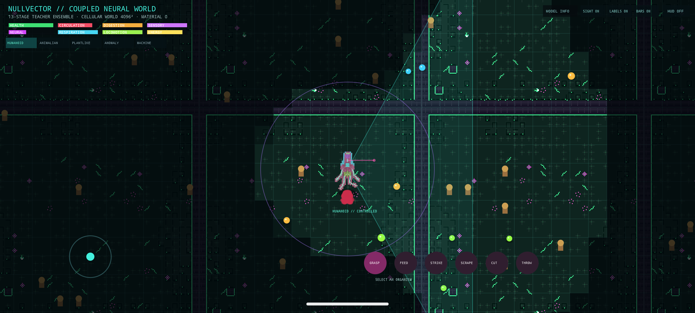

# Nullvector Mobile

Android deployment foundation for the Samsung Galaxy S25 Ultra.



[Runtime model panel](../../examples/showcase/android_coupled_ensemble_diagnostics_v05.png) · [machine-readable run evidence](../../examples/showcase/android_coupled_ensemble_v05.json)

Version 0.5 runs the coupled desktop teacher ensemble inside the playable neural habitat. The cellular organism stays vertically aligned in a camera-following 2.5D world; touch controls movement and aim, thrown material follows a height/shadow ballistic arc, and persistent nutrient, fluid, and mineral clumps react to contact or impact. Absorbed resources enter the organism's cellular physiology before the next neural update. The selected posed body is restyled continuously by the cell VAE without allowing the rasterizer to create, hide, or repair physical cells.

`MODEL INFO` opens an explicitly labeled internal runtime view. It reports each neural graph, precision, cadence, parameter count and measured latency. Its blurry image is retained as a world-latent decoder probe—not a creature render or normal gameplay view—and runs only at debug cadence while the panel is open.

The APK now schedules thirteen ONNX stages over one world state: structured context, recurrent action, cell physiology, grounded muscle/contact control, articulated grasping, ecology, organism rasterization, macro resources, colony roles, society/construction, timeline forecasting, counterfactual intervention scoring, and the debug-only world-frame decoder. High-level models run at lower cadences than movement and physiology; their outputs alter the same resource fields, roles, structures, and settlement state used by the local simulation.

Two side-by-side preview flavors are available:

- `fp32`: full FP32 action graph. Package `world.nullvector.mobile.fp32`.
- `int8`: 13.2 MiB INT8 QDQ action graph plus 2.3 MiB FP32 actor graph. Package `world.nullvector.mobile.int8`.

Both flavors share the local and high-level teacher ensemble. The correct FP32 bundle is intentionally large (roughly 421 MiB of shared ONNX graphs before the action model); calibrated FP16/INT8 conversion and model-by-model QNN partitioning follow correctness testing on the physical S25.

The INT8 candidate preserves actor outputs to numerical precision and diverges from the FP32 action rollout by 0.0090 latent units after 16 prediction-fed steps. The action student retains 74% of the desktop teacher's raw counter-action sensitivity at 32.7% of its parameters.

The desktop ensemble remains authoritative until rollout parity and 24–30 FPS are measured on a physical Galaxy S25 Ultra. QNN FP16/INT8 partitioning follows that baseline measurement.

Build both arm64 preview APKs with:

```powershell
.\gradlew.bat assembleFp32Release assembleInt8Release --no-daemon
```

Preview APKs are development-signed for sideloading. Production distribution will use a dedicated release key after physical-device validation.
