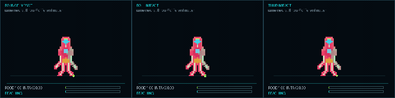
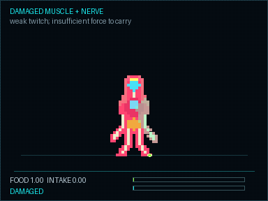
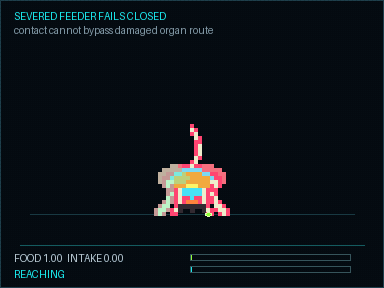

# Output gallery

Selected outputs from the current NULLVECTOR pipeline. These are generated
results, not concept art. Some show accepted runtime systems; others are
clearly labeled research prototypes.

## Physical creatures

### Grounded locomotion and feeding

The neural target field, muscle controller, and contact controller approach a
material clump. An articulated arm then carries it into live feeder cells. Feet
remain planted and the held object stays constrained to the hand.

### Five acquisition strategies

Humanoids kneel and grasp. Animals bite from the ground. Plants siphon through
roots. Anomalies use a phase field. Machines collect with a suspension-mounted
tool.

### Throwing and material response

Thrown matter has horizontal momentum, elevation, a ground-plane shadow,
gravity, recoil, and landing behavior.

Different materials bounce, roll, or thud.

### Damage and severing

The complete arm detaches at the shoulder, drops its payload, twitches briefly,
and settles. The intact shoulder returns to rest.

Severe neural and muscle damage leaves residual motion but prevents useful
grasping.

Destroying feeder cells prevents absorption even when material reaches the
body.

## Neural motion and rendering

### Cellular locomotion

A learned cellular motion loop across the five organism families. Each point
is a body cell.

### Grounded controller

The accepted grounded controller predicts causal muscle and contact feedback
inside physical constraints.

### Anatomical VAE

A continuous anatomical graph VAE reconstructing held-out creature motion.

Target and reconstruction frames across families and motion phases.

## Cells, inheritance, and trauma

| Breeding and symmetry | Cellular trauma | Neural cellular dynamics |
|---|---|---|
|  |  |  |

These cover inherited chassis variation, organs and fluids, damage, healing,
scarring, debris, and learned local cell-state updates.

## World systems

| Living world | Map themes | Neural topology |
|---|---|---|
|  |  |  |

The playable scaffold includes ecology, resources, organisms, construction,
and settlements. Maps begin as validated semantic topology before art is
rendered. Neural topology remains under evaluation and does not bypass the
safety repair stage.

## World-model research

| World VAE | Sparse Action-DiT |
|---|---|
|  |  |

The world VAE reconstructs held-out frames. The sparse Action-DiT prototype
learned localized action edits but did not pass the stricter latent acceptance
gate, so it is evidence rather than runtime authority.

## Storage

This gallery stays small enough to browse on GitHub. Full corpora, checkpoints,
replay banks, failure cases, and evaluation reports remain under the local
`outputs/` tree and are not included in normal Git history.
