# NULLVECTOR output gallery

These files are copied byte-for-byte from validated or explicitly labeled
research outputs so GitHub can display actual results without cloning the full
output archive. They span the deterministic scaffold and neural replacements.
They are not hand-drawn mockups.

## Creature construction and motion

### Neural cellular locomotion

The learned cellular motion loop compared with its motion authority across all
five families. Each visible point is a tissue cell. Source:
`outputs/creature_stage_neural_motion_loop/showcase_update1000/`.

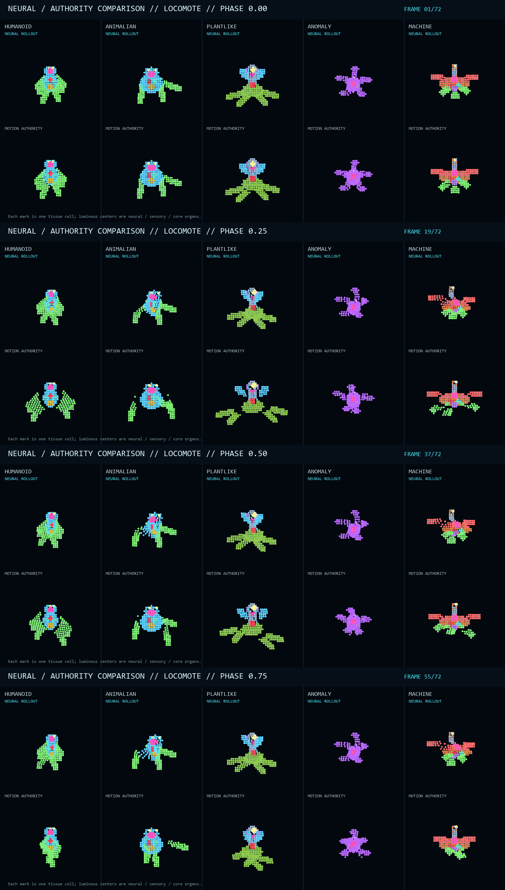

### Anatomical VAE raster and motion

The continuous anatomical graph VAE reconstructing held-out motion. The paired
sheet below shows target and neural reconstruction across families and phases.
Source: `outputs/organism_raster_vae_v5_anatomical/evaluation_0600_hierarchical/`.

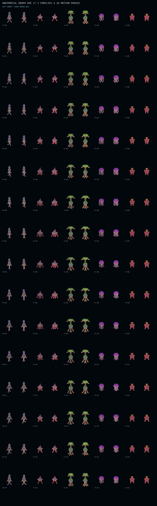

### Grounded neural controller and procedural teacher

The first animation is a learned grounded controller. The second is the
procedural developmental authority used for human-in-the-loop morphology and
locomotion review. Sources:
`outputs/creature_stage_neural_grounded_controller/evaluation_0800_final_verified/`
and `outputs/creature_stage_developmental/review_v7/`.

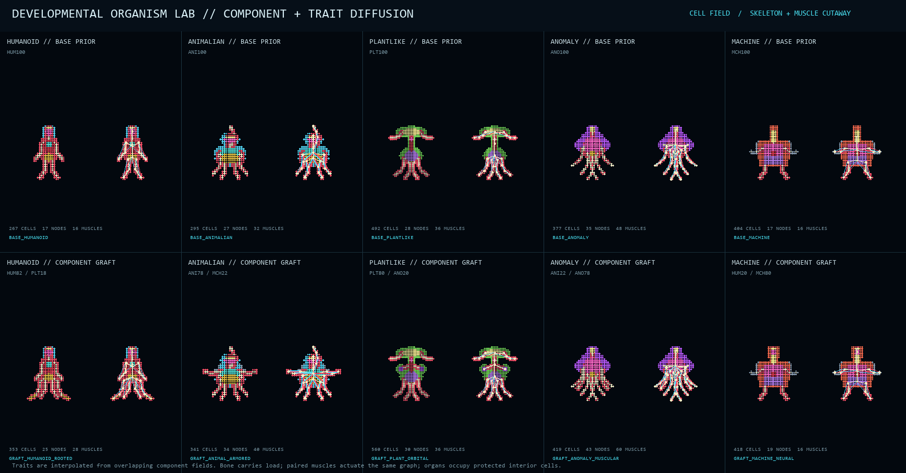

## Cellular life and damage

### Articulated neural manipulation

The accepted neural controller selects the appendage, reach, force, and brace.
A segment-local skin keeps the cellular arm as thick as the legs. Recurrent
joint velocity, muscle-like terminal drive, and iterative length constraints
curl the held clump back to actual mouth cells without pose snapping.

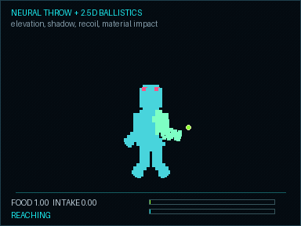

The released clump retains its impulse, gains independent elevation, casts a
ground-plane shadow, falls under gravity, and transfers recoil to the body.
Horizontal air drag is low enough for a meaningful throw arc.

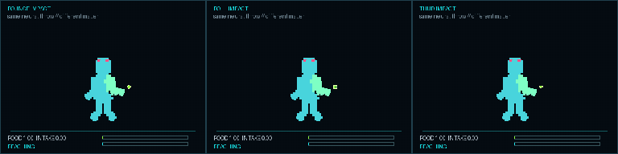

Phase/charge matter rebounds, rounded mineral matter keeps rolling, and soft
biomass absorbs impact and thuds. These use the same neural throw command with
different physical material responses.

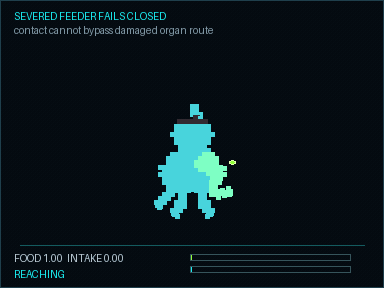

Damage to the feeder cells prevents reserve gain even after physical contact.
Source: `outputs/creature_stage_manipulation_v1/showcase_v3/`.

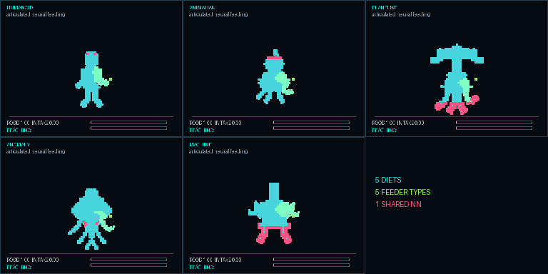

One synchronized replay exposes the morphology-specific arm, limb, root/frond,
tendril, and hardpoint paths. All five share the accepted neural controller;
their cells, joints, feeder apertures, and compatible nutrients remain distinct.

Breeding, soft-organic symmetry, additive chassis growth, organ/fluid fields,
and descendant variation. Source: `outputs/cellular_breeding_symmetry_v1/`.

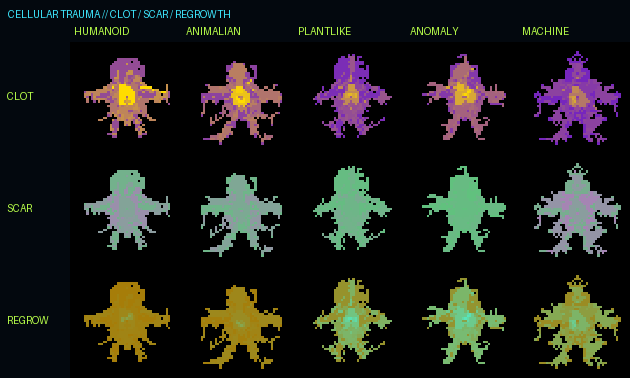

Damage, severing, fluid loss, scar/heal state, and cellular debris evidence.
Source: `outputs/cellular_trauma_v4/`.

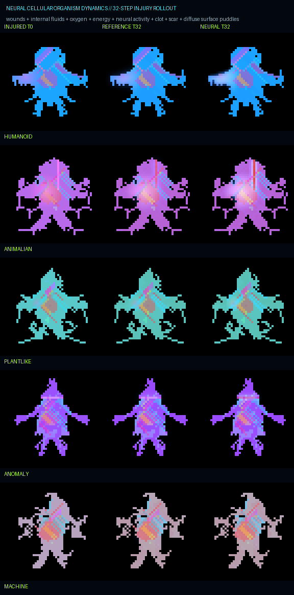

Learned local cellular dynamics rollout. Source: `outputs/cellular_nca/nca_v1/`.

## World, maps, and neural frame models

The playable 2.5D ecology scaffold with organisms, systems, resources,
settlements, interactions, and action tools. Source: `outputs/nature_sim_v2/`.

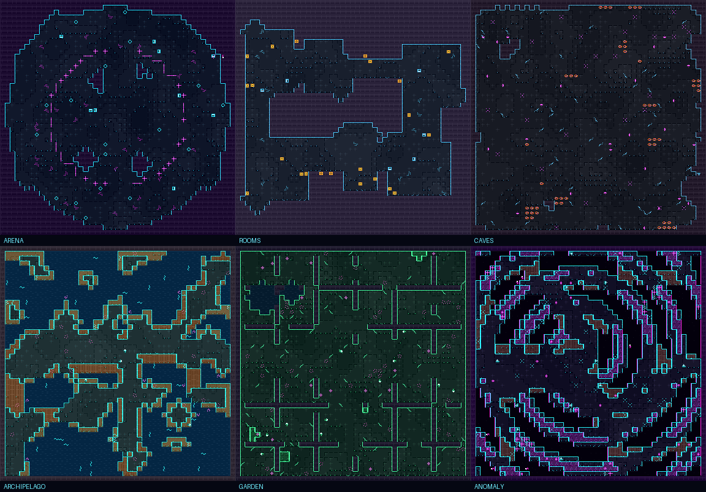

Six semantic/topology-bound pixel map themes. Source: `outputs/map_art/`.

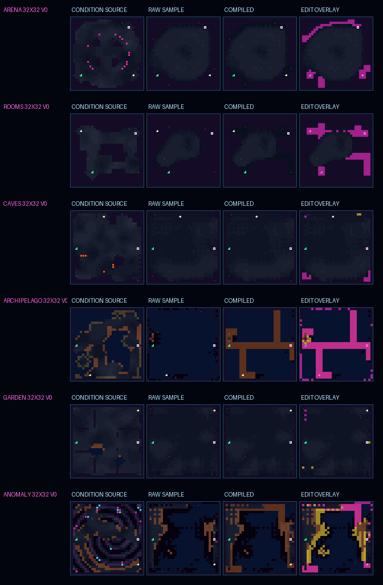

Neural topology proposal plus deterministic safety repair evidence. Source:
`outputs/map_topology_neural_prior_generation/seeded_test_v1/`.

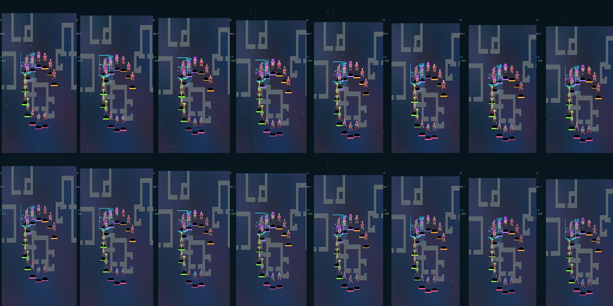

Held-out continuous world-frame VAE reconstruction. Source:
`outputs/world_frame_vae/production_v2_high_fidelity/`.

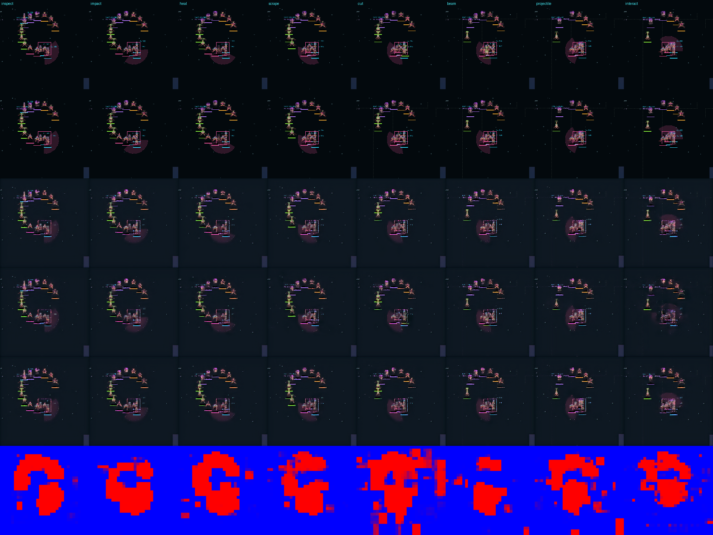

Sparse action-conditioned latent editor evaluation. It localized edits and
improved decoded RGB over refined persistence, but did not pass the stricter
latent gate; it is retained as honest evidence rather than promoted as a final
runtime. Source: `outputs/world_action_sparse_v5/production_v5_sparse/`.

## Scope

The gallery is deliberately compact (under 10 MiB). The complete output tree
contains checkpoints, full corpora, replay manifests, intermediate failures,
contact sheets, videos, and 16,000+ files. Generated corpora and checkpoints
remain outside normal Git history so clones stay practical and GitHub's object
limits are respected.
